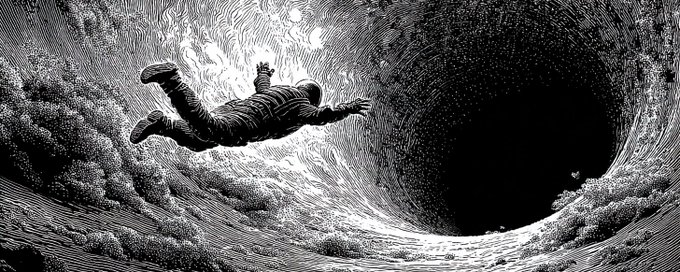
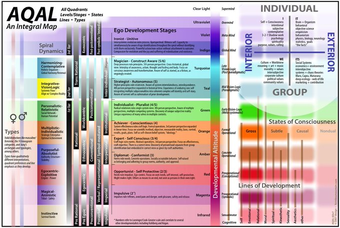
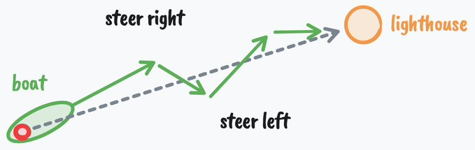

# How to fix your entire life in 1 day

:::en
If you're anything like me, you think new years resolutions are stupid.
:::

:::zh
如果你和我一样，你会觉得新年决心这种东西很愚蠢。
:::

:::en
Because most people go about changing their lives in the completely wrong way. They create these resolutions because everyone else does – we create a superficial meaning out of status games – but they don't meet the requirements for true change, which goes a lot deeper than convincing yourself you're going to be more disciplined or productive this year.
:::

:::zh
因为大多数人改变生活的方式完全错了。他们制定这些决心只是因为别人都在这么做——我们在社会地位的游戏中制造出一种表面的意义——但这些决心并不符合真正改变的要求，真正的改变远比说服自己"今年我要更自律、更高效"要深刻得多。
:::

:::en
If you're one of these people, I'm not here to talk down on you (I tend to be a bit harsh in my writing). I've quit 10x more goals than I've achieved. I think that should be the case for most people. But the fact that people try to change their lives and utterly fail almost every time holds true.
:::

:::zh
如果你也是这样的人，我不是要批评你（我的写作风格可能有点尖锐）。我放弃的目标比我完成的目标多十倍。我觉得大多数人都是如此。但人们试图改变生活却几乎每次都彻底失败，这是一个普遍的事实。
:::

:::en
However, as much as I think new years resolutions are stupid, it's always wise to reflect on the life you hate so you can launch yourself toward something that much better, as we will discuss.
:::

:::zh
然而，尽管我认为新年决心很愚蠢，但反思你讨厌的生活始终是明智的，这样你才能向着更好的方向前进，我们接下来会讨论这一点。
:::

:::en
So whether you want to start the business, transform your body, or take the risk toward a more meaningful life without quitting after 2 weeks, I want to share 7 ideas you probably haven't heard before on behavior change, psychology, and productivity so you can do just that in 2026.
:::

:::zh
所以无论你是想创业、改变身材，还是冒险追求更有意义的生活而不在两周后放弃，我想分享 7 个你可能从未听过的关于行为改变、心理学和效率的观点，帮助你实现这些目标。
:::

:::en
This will be comprehensive.
:::

:::zh
这将会是一篇详尽的文章。
:::

:::en
This isn't one of those letters that you read through and forget about.
:::

:::zh
这不是那种你读完就忘记的文章。
:::

:::en
This is something you will want to bookmark, take notes on, and set aside time to think about.
:::

:::zh
这是一篇你会想要收藏、做笔记、并花时间思考的内容。
:::

:::en
The protocol at the end (to dig deep into your psyche and uncover what you truly want in life) will take about a full day to complete, with effects that last far longer than that.
:::

:::zh
最后的方法（深入挖掘你的内心，发现你真正想要的生活）大约需要一整天来完成，但其效果会持续更久。
:::

:::en
Let's begin.
:::

:::zh
让我们开始吧。
:::

:::entitle
## I – You aren't where you want to be because you aren't the person who would be there
:::

:::zhtitle
## 一、你不在你想去的地方，因为你不是那个能在那里的人
:::

:::en
When it comes to setting big goals, people tend to focus on one of the two requirements for success:
:::

:::zh
谈到设定大目标时，人们往往只关注成功的两个要素之一：
:::

:::en
1. Changing your actions to make progress toward the goal (least important, second order)
2. Changing who you are so that your behavior naturally follows (most important, first order)
:::

:::zh
1. 改变你的行为以朝着目标前进（次要，第二层级）
2. 改变你这个人，让你的行为自然跟随（首要，第一层级）
:::

:::en
Most people set a surface-level goal, hype themselves up to remain disciplined for the first few weeks, then go back to their old ways without much struggle, because they were trying to build a great life on a rotting foundation.
:::

:::zh
大多数人设定一个表面的目标，在最初几周激励自己保持自律，然后几乎毫无挣扎地回到旧习惯，因为他们试图在一个腐烂的基础上建立美好的生活。
:::

:::en
If this doesn't make sense, let's run through an example.
:::

:::zh
如果这听起来不太明白，让我们来看一个例子。
:::

:::en
Think of somebody successful. It can be a bodybuilder with a great physique, a founder/CEO worth hundreds of millions, or a charismatic dude who can chat up a group without a shred of anxiety entering his mind.
:::

:::zh
想想某个成功的人。可以是身材健美的健美运动员、身价数亿的创始人/CEO，或者是能在人群中自如交谈、内心毫无焦虑的魅力人士。
:::

:::en
Do you think the bodybuilder has to "grind" to eat healthy? Does the CEO have to discipline themselves to show up and lead the team? To you, it may seem like that on the surface, but the truth is that *they can't see themselves living any other way.* The bodybuilder has to grind to eat **unhealthily**. The CEO has to force themself to lie in bed past their alarm clock, and they hate every second of it (there is nuance here, just entertain me for a second).
:::

:::zh
你觉得健美运动员需要"拼命努力"才能吃得健康吗？CEO需要强迫自己出现并带领团队吗？表面上看起来可能如此，但真相是*他们无法想象自己以其他方式生活*。健美运动员要拼命努力才能吃得**不健康**。CEO要强迫自己赖床超过闹钟时间，而且每一秒都让他们讨厌（这里有一些细微差别，暂时先接受我的说法）。
:::

:::en
To some people, my own lifestyle seems a bit extreme and disciplined. To me, it's natural, and I don't say that to contrast it with any other kind of lifestyle. I simply enjoy living this way. When my mom tells me that I should take a break, go out, and have some fun... I hold my tongue from telling her, "If I weren't having fun, why would I be doing what I'm doing?"
:::

:::zh
对一些人来说，我自己的生活方式看起来有点极端和自律。对我来说，这是自然的，我这么说并不是为了与其他生活方式对比。我只是简单地享受这样生活。当我妈妈告诉我应该休息、出去、玩一玩的时候……我忍住没告诉她："如果我不觉得有趣，我为什么要做我现在做的事情？"
:::

:::en
This next sentence may sound simple, but it is baffling how many people don't get it.
:::

:::zh
接下来这句话听起来可能很简单，但令人困惑的是有多少人不明白这一点。
:::

:::en
If you want a specific outcome in life, you must have the *lifestyle* that creates that outcome long before you reach it.
:::

:::zh
如果你想要生活中的某个特定结果，你必须在你达到它之前很久就拥有能创造那个结果的*生活方式*。
:::

:::en
If someone says they want to lose 30 pounds, I often don't believe them. Not because I don't think they are capable, but because there are too many times when that same person says, "I can't wait until I'm done losing weight so I can start to enjoy life again." I hate to break it to you, but if you don't adopt the lifestyle that led to you losing the weight, for life, and find a *reason with a higher gravitational pull* than the one tying you to your previous ways, then you will go straight back to where you started, and you can unhappily say that you wasted the resource you will never get back: time.
:::

:::zh
如果有人说他们想减掉30磅，我通常不相信他们。不是因为我觉得他们做不到，而是因为太多时候，同一个人会说："我迫不及待等到减肥结束，这样我就可以重新开始享受生活了。"我不想让你失望，但如果你不终身采用让你减重的那个生活方式，并找到一个比束缚你旧习惯*引力更强的理由*，你会直接回到起点，然后不快乐地说你浪费了永远无法挽回的资源：时间。
:::

:::en
When you truly change yourself, all of your habits that don't move the needle toward your goal become disgusting, because you have a deep and profound awareness of what kind of life those actions compound into. You are okay with your current standards because you are not fully aware of what they are or what they lead to. We will discuss how to uncover this, but we need to build up to that.
:::

:::zh
当你真正改变自己时，所有不能推动你目标前进的习惯都会变得令人厌恶，因为你深刻意识到这些行为会累积成什么样的生活。你对当前的标准感到满意，是因为你没有完全意识到这些标准是什么或它们会导致什么。我们会讨论如何揭示这一点，但我们需要循序渐进。
:::

:::en
You say you want to change. You say you want to "become financially free" and "get healthy," but your actions show otherwise for a reason. And it goes a lot deeper than you think.
:::

:::zh
你说你想改变。你说你想"实现财务自由"和"变得健康"，但你的行为却表明相反的事实，这是有原因的。而且这比你想象的要深刻得多。
:::

---

:::entitle
## II – You aren't where you want to be because you don't *want* to be there
:::

:::zhtitle
## 二、你不在你想去的地方，因为你并不*想*去那里
:::

:::en
> Trust only movement. Life happens at the level of events, not of words. Trust movement.
>
> – Alfred Adler
:::

:::zh
> 只相信行动。生活发生在事件层面，而非语言层面。相信行动。
>
> —— 阿尔弗雷德·阿德勒
:::

:::en
If you want to change who you are, you must understand *how the mind works* so that you can start to reprogram it.
:::

:::zh
如果你想改变自己，你必须理解*大脑是如何运作的*，这样你才能开始重新编程它。
:::

:::en
The first step to understanding the mind is to understand that all behavior is goal-oriented. It's teleological. When you think about it, this is kinda obvious, but when we dig into it, most people don't want to hear it.
:::

:::zh
理解大脑的第一步是理解所有行为都是目标导向的。这是目的论的。仔细想想，这有点显而易见，但当我们深入探讨时，大多数人并不想听到这个。
:::

:::en
You take a step forward because you want to reach a certain location.
:::

:::zh
你向前迈一步是因为你想到达某个位置。
:::

:::en
You scratch your nose because you want to make the itch go away.
:::

:::zh
你挠鼻子是因为你想让痒消失。
:::

:::en
Those ones are clear, but most of the time, your goals are unconscious. You may not realize that when you sit on the couch in the middle of the day, you are trying to burn time before your next responsibility, as one simple example.
:::

:::zh
这些例子很清楚，但大多数时候，你的目标是无意识的。你可能没意识到，当你在白天坐在沙发上时，你是在试图消磨下一个责任到来之前的时间，这是一个简单的例子。
:::

:::en
On an even more unconscious and complex level, you pursue goals that can harm you, but you justify your actions in a way that is socially acceptable and doesn't make you seem like a loser.
:::

:::zh
在更深层次的无意识和复杂层面上，你追求可能伤害你的目标，但你用社会可接受的方式为自己的行为辩护，让自己看起来不像个失败者。
:::

:::en
As an example, if you can't stop procrastinating your work, you may justify it with the fact that you "lack discipline," but in reality, you are attempting to achieve a goal like you always are. In this case, that goal could be to *protect yourself from the judgment that comes from finishing and sharing your work.*
:::

:::zh
举个例子，如果你无法停止拖延工作，你可能会用"缺乏自律"来为自己辩护，但实际上，你像往常一样在试图达成某个目标。在这种情况下，那个目标可能是*保护自己免受完成和分享作品后可能面临的评判*。
:::

:::en
If you say you want to quit your dead-end job, but stay in it without any real reason, you may start to think you don't have enough courage, or that you were never really a "risk taker," but the truth is that you are pursuing the goal of safety, predictability, and an excuse to not look like a failure to everyone else in your life who sees working a dead-end job as a sign of success.
:::

:::zh
如果你说你想辞掉那个没有前途的工作，却毫无真正理由地留在那里，你可能开始认为自己没有足够的勇气，或者你从来不是一个"敢于冒险的人"，但真相是你正在追求安全、可预测的目标，以及一个借口——在那些把做着没有前途的工作视为成功标志的人面前，你不会看起来像个失败者。
:::

:::en
The lesson here is that real change requires changing your goals.
:::

:::zh
这里学到的教训是：真正的改变需要改变你的目标。
:::

:::en
I don't mean *setting* some surface-level goal *because the act of doing that serves an unconscious goal that is actually harming you*. That's been ran through enough in the productivity space. I mean changing your *point of view.* Because that's what a goal is. A goal is a projection into the future that acts as a lens of perception which allows you to notice information, ideas, and resources that aid in you achieving that goal.
:::

:::zh
我不是指*设定*某个表面目标，*因为这样做本身服务于一个实际上在伤害你的无意识目标*。这在效率领域已经讨论得够多了。我是指改变你的*视角*。因为这就是目标的本质。目标是对未来的投射，它作为感知的透镜，让你注意到有助于实现目标的信息、想法和资源。
:::

:::en
Now let's dig a bit deeper, because if you don't understand this, it only becomes more difficult to get out.
:::

:::zh
现在让我们深入一点，因为如果你不理解这一点，摆脱困境只会变得更加困难。
:::

---

:::en
I send out letters like these 1-2x a week. If you don't want to miss them, [join here](https://letters.thedankoe.com). You can also read my book free, other letters, etc.
:::

:::zh
我每周发送1-2封这样的邮件。如果你不想错过，[点击这里加入](https://letters.thedankoe.com)。你也可以免费阅读我的书和其他邮件等。
:::

---

:::entitle
## III – You aren't where you want to be because you're afraid to be there
:::

:::zhtitle
## 三、你不在你想去的地方，因为你害怕去那里
:::

:::en
> The important thing for you to remember is that it does not matter in the least how you got the idea or where it came from. You may never have met a professional hypnotist. You may never have been formally hypnotized. But if you have accepted an idea - from yourself, your teachers, your parents, friends, advertisements, from any other source - and further, if you are firmly convinced that idea is true, it has the same power over you as the hypnotist's words have over the hypnotized subject.
>
> – Maxwell Maltz
:::

:::zh
> 你需要记住的重要一点是：你如何获得某个想法或它来自哪里完全不重要。你可能从未见过专业催眠师。你可能从未被正式催眠过。但如果你接受了一个想法——来自你自己、老师、父母、朋友、广告或其他任何来源——而且如果你坚信这个想法是真的，它对你就有和催眠师对被催眠者的话语同样强大的力量。
>
> —— 麦克斯韦·马尔茨
:::

:::en
Here's how you've become who you are today, and how you will become who you will be tomorrow. This is the anatomy of identity:
:::

:::zh
以下是你如何成为今天的你，以及你明天将成为什么样的人。这就是身份的结构：
:::

:::en
1. You want to achieve a goal
2. You perceive reality through the lens of that goal
3. You only notice "important" information and ideas that allows you to achieve that goal (learning)
4. You act toward that goal and receive feedback that you are progressing toward it
5. You repeat that behavior until it becomes automatic and unconscious (conditioning)
6. That behavior becomes a part of who you think you are ("I am the type of person who...")
7. You defend your identity to maintain psychological consistency
8. Your identity shapes new goals, restarting the cycle, and if that identity is disadvantageous toward a good life, this gets bad very quick
:::

:::zh
1. 你想要达成某个目标
2. 你通过那个目标的透镜感知现实
3. 你只注意到能帮助你达成目标的"重要"信息和想法（学习）
4. 你朝着那个目标行动，并获得你正在接近目标的反馈
5. 你重复那个行为，直到它变得自动化和无意识（条件反射）
6. 那个行为成为你认为自己是谁的一部分（"我是那种……的人"）
7. 你捍卫你的身份以保持心理一致性
8. 你的身份塑造新的目标，重新开始循环，如果那个身份对美好生活不利，情况会很快变得糟糕
:::

:::en
The unfortunate reality is that you must break the cycle between steps 6 and 7, but this process starts when you are a child.
:::

:::zh
不幸的现实是你必须在第6步和第7步之间打破循环，但这个过程从你还是个孩子时就开始了。
:::

:::en
You have the goal of survival.
:::

:::zh
你有生存的目标。
:::

:::en
You are dependent on your parents to teach you how to survive. You had to conform. And since the way most people teach is through reward and punishment, unless you adopt their beliefs and values, you will be punished. You don't actually think for yourself until you see through this.
:::

:::zh
你依赖父母教你如何生存。你必须顺从。既然大多数人的教育方式是通过奖励和惩罚，除非你接受他们的信念和价值观，你就会受到惩罚。你看透这一点之前，你实际上并没有为自己思考。
:::

:::en
But your parents have also gone through this process throughout their entire lives. That's where it can get dangerous. Your parents, unless they broke the pattern themselves, were conditioned by the culturally accepted ideas of success from the Industrial age. They also carry the best and worst conditioning from their parents and their parents' parents.
:::

:::zh
但你的父母也在他们的一生中经历了这个过程。这就是危险所在。你的父母，除非他们自己打破了模式，也被工业时代文化接受的成功观念所条件化。他们还继承了他们父母和祖父母身上最好和最坏的条件反射。
:::

:::en
To take it a layer deeper, once you fulfill your physical survival needs (which is quite easy to do in today's world, you're practically born into safety), you start to survive on the conceptual or ideological level. You may not try to protect and reproduce your body, but you absolutely protect and reproduce your mind. It's not difficult to see the war of ideas on the internet, and the participants are individual and group identities.
:::

:::zh
更深一层来看，一旦你满足了身体生存需求（在今天的世界这很容易做到，你几乎生来就安全），你开始在概念或意识形态层面生存。你可能不会试图保护和繁衍你的身体，但你绝对会保护和繁衍你的思想。不难看到互联网上观念的战争，参与者是个人和群体身份。
:::

:::en
When your body feels threatened, you go into fight or flight.
:::

:::zh
当你的身体感到威胁时，你会进入战斗或逃跑模式。
:::

:::en
When your identity feels threatened, the same thing happens.
:::

:::zh
当你的身份感到威胁时，同样的事情会发生。
:::

:::en
If you are heavily identified with a political ideology (by the process we talked about just before), you will feel threatened when someone challenges your beliefs. You literally feel the stress. You feel, emotionally, like you were just slapped in the face. Since most people don't analyze their emotions for truth, you tend to get stuck in echo chambers and double down on claims that harm yourself and others.
:::

:::zh
如果你深度认同某个政治意识形态（通过我们刚才讨论的过程），当有人挑战你的信念时你会感到威胁。你真的会感受到压力。在情感上，你感觉像是被人扇了一巴掌。既然大多数人不会分析他们情绪中的真相，你往往会陷入信息茧房，并加倍坚持那些伤害自己和他人主张。
:::

:::en
If you were raised in a religious household, and did not think for yourself, you will fight and attack others who threaten your psychological safety within that little bubble.
:::

:::zh
如果你在宗教家庭长大，没有独立思考，你会攻击那些威胁你在那个小圈子里心理安全感的人。
:::

:::en
The same thing happens when you unconsciously see yourself as a lawyer, a gamer, or somebody else who would not take the actions to achieve a better life.
:::

:::zh
当你无意识地将自己视为律师、游戏玩家或其他不会采取行动追求更好生活的人时，同样的事情也会发生。
:::

---

:::entitle
## IV – The life you want lies within a specific level of mind
:::

:::zhtitle
## 四、你想要的生活存在于心智的特定层级
:::

:::en
The mind evolves through predictable stages over time.
:::

:::zh
心智随着时间的推移会经历可预测的阶段。
:::

:::en
When you're born, you're like a little survival sponge that absorbs whatever beliefs you can (which are heavily dictated by your culture) so that you can feel safe and secure. And if you don't be careful, your mind may crystalize and it may make it difficult to live a meaningful life.
:::

:::zh
当你出生时，你就像一个小生存海绵，吸收你能吸收的任何信念（这很大程度上由你的文化决定），以便让你感到安全和稳定。如果你不小心，你的心智可能会固化，这会让过上有意义的生活变得困难。
:::

:::en
This has been documented enough in models like Maslow's Hierarchy, Greuter's stages of ego development, Spiral Dynamics, and Integral Theory, each building off of one another, but it's also not difficult to observe in society.
:::

:::zh
这在马斯洛需求层次理论、Greuter的自我发展阶段、螺旋动力学和整合理论等模型中已有充分记录，每个模型都建立在彼此之上，但这在社会中也不难观察到。
:::

:::en
I've talked about these many times, and synthesized them into my own [Human 3.0 model](https://letters.thedankoe.com/p/human-30-a-map-to-reach-the-top-1?lli=1) with various AI prompts to uncover your level of development and a path forward (open in a tab to read after if you'd like), but here's the 80/20 of the 9 stages of ego development as a refresher (because repetition helps reveal things you didn't notice before, and there are new people reading these letters):
:::

:::zh
我已经多次讨论过这些，并将它们整合到我自己的[Human 3.0模型](https://letters.thedankoe.com/p/human-30-a-map-to-reach-the-top-1?lli=1)中，包含各种AI提示来揭示你的发展水平和前进路径（如果你想可以打开新标签页稍后阅读），但这里是自我发展9个阶段的核心要点（因为重复有助于揭示你之前没注意到的东西，也有新读者在阅读这些内容）：
:::

:::en
1. **Impulsive** — No separation between impulse and action. Black and white thinking. *I.e. A toddler hits when angry because the feeling and the behavior are the same thing.*
2. **Self-Protective** — The world is dangerous and you learn to look out for yourself. *I.e. A kid learns to hide report cards, lie about chores, and figure out what adults want to hear.*
3. **Conformist** — You are your group and its rules feel like reality itself. *I.e. Someone who genuinely cannot fathom why anyone would vote differently than their family or group.*
4. **Self-Aware** — You notice you have an inner life that doesn't match the exterior. *I.e. Sitting in church and realizing you're not sure you believe what everyone around you seems to believe, but not knowing what to do with that feeling yet.*
5. **Conscientious** — You build your own system of principles and hold yourself accountable to them. *I.e. Leaving your family's religion after careful study and adopting a personal philosophy you can defend, or building a career plan with clear milestones because you believe the right effort yields the right results.*
6. **Individualist** — You see that your principles were shaped by context and start holding them more loosely. *I.e. Realizing your political views have more to do with where you grew up than objective truth, or noticing that your ambitious career goals were really about earning your father's approval.*
7. **Strategist** — You work with systems while aware of your own involvement in them. *I.e. Leading an organization while actively questioning your own blind spots, or engaging in politics knowing your perspective is partial and shaped by bias you can't fully see.*
8. **Construct-Aware** — You see all frameworks, including your identity, as useful fictions. *I.e. Holding your spiritual beliefs with metaphorically not literally, knowing the map is not the territory, or watching yourself play the role of "founder" or "thought leader" with a kind of gentle amusement.*
9. **Unitive** — Separation between self and life dissolves. *I.e. Work, rest, and play feel like the same thing. There's no one left who needs to become something, just presence responding to what arises.*
:::

:::zh
1. **冲动阶段** — 冲动和行动之间没有分离。黑白思维。*例如：幼儿生气时会打人，因为感觉和行为是同一回事。*
2. **自我保护阶段** — 世界是危险的，你学会保护自己。*例如：孩子学会藏成绩单、谎报家务完成情况，并琢磨大人想听什么。*
3. **顺从阶段** — 你就是你的群体，群体的规则感觉就是现实本身。*例如：一个人真的无法理解为什么有人会投票给和他们家庭或群体不同的人。*
4. **自我觉察阶段** — 你注意到你有与外在不符的内心生活。*例如：坐在教堂里，意识到你不确定自己是否相信周围人似乎相信的东西，但还不知道如何处理这种感觉。*
5. **尽责阶段** — 你建立自己的原则体系，并对自己负责。*例如：经过认真研究后离开家庭宗教，采纳你能捍卫的个人哲学，或制定有清晰里程碑的职业计划，因为你相信正确的努力会产生正确的结果。*
6. **个人主义阶段** — 你看到你的原则是由环境塑造的，开始更松散地持有它们。*例如：意识到你的政治观点更多与你在哪里长大有关而非客观真理，或注意到你雄心勃勃的职业目标实际上是为了获得父亲的认可。*
7. **战略家阶段** — 你在系统中工作，同时意识到自己参与其中。*例如：领导一个组织时主动质疑自己的盲点，或参与政治活动时知道你的视角是片面的且由你无法完全看到的偏见塑造。*
8. **建构觉察阶段** — 你看到所有框架，包括你的身份，都是有用的虚构。*例如：隐喻地而非字面地持有你的精神信念，知道地图不是领土本身，或带着一种温和的趣味观察自己扮演"创始人"或"思想领袖"的角色。*
9. **合一阶段** — 自我与生活之间的分离消融。*例如：工作、休息和玩耍感觉是同一件事。不再有一个需要成为某样东西的人，只有临在应对发生的一切。*
:::

:::en
For most people reading this, I would assume you hover between 4 and 8, which is a huge gap. Those closer to 8 are reading this are doing so to either learn something or pass time in a non-destructive way. Those closer to 4 are really looking for a change. You feel like you are meant for more, but you can't make sense of everything yet, because there's obviously a lot at play.
:::

:::zh
对于大多数阅读这篇文章的人，我假设你在第4到第8阶段之间徘徊，这是一个很大的跨度。接近第8阶段的人阅读这篇文章是为了学习或以非破坏性的方式消磨时间。接近第4阶段的人真的在寻找改变。你感觉自己注定要做更多，但你还不能理清一切，因为显然有很多因素在起作用。
:::

:::en
The good thing is, it doesn't really matter what stage you are in, because moving through any of them follows a pattern.
:::

:::zh
好消息是，你在哪个阶段并不重要，因为穿越任何阶段都遵循一个模式。
:::

---

:::entitle
## V – Intelligence is the ability to get what you want out of life
:::

:::zhtitle
## 五、智力是从生活中得到你想要的东西的能力
:::

:::en
> The only real test of intelligence is if you get what you want out of life.
>
> – Naval Ravikant
:::

:::zh
> 智力的唯一真正测试是你能否从生活中得到你想要的东西。
>
> —— 约瓦尔·拉维坎特
:::

:::en
There is a formula for success.
:::

:::zh
成功有一个公式。
:::

:::en
One ingredient is **agency**.
:::

:::zh
一个要素是**能动性**。
:::

:::en
One ingredient is **opportunity** (which many people like to mistake as "privilege" - because they the other ingredients).
:::

:::zh
一个要素是**机会**（很多人喜欢把这误认为是"特权"——因为他们缺少其他要素）。
:::

:::en
The last ingredient is **intelligence**.
:::

:::zh
最后一个要素是**智力**。
:::

:::en
If you have high agency but low opportunity, it doesn't matter how likely you are to act toward a goal, because it isn't a goal that will bear much fruit.
:::

:::zh
如果你有高能动性但低机会，你有多可能朝着目标行动并不重要，因为那不是一个能产生多少成果的目标。
:::

:::en
If you have opportunity and agency but low intelligence, then you will never be fully able to benefit from that opportunity.
:::

:::zh
如果你有机会和能动性但低智力，那么你永远无法完全从那个机会中获益。
:::

:::en
First, we've talked about agency before here. In terms of opportunity, I can't tell you to change your physical location, but if you don't see the abundance of digital opportunity right in front of you, I don't know what to tell you.
:::

:::zh
首先，我们之前在这里讨论过能动性。关于机会，我不能告诉你改变你的物理位置，但如果你看不到眼前丰富的数字机会，我不知道该告诉你什么。
:::

:::en
With that said, I want to focus on *what intelligence is* in the context of these two other ingredients and this letter. For that, we look to cybernetics.
:::

:::zh
话虽如此，我想聚焦于在这两个其他要素和这篇文章的语境下*智力是什么*。为此，我们看看控制论。
:::

:::en
> Cybernetics comes from the greek word *kybernetikos* which means "to steer" or "good at steering."
:::

:::zh
> 控制论来自希腊词*kybernetikos*，意思是"驾驶"或"善于驾驶"。
:::

:::en
It's also known as "the art of getting what you want."
:::

:::zh
它也被称为"得到你想要的东西的艺术"。
:::

:::en
So, if Naval's definition of intelligence is getting what you want out of life, understanding cybernetics helps you do that much faster.
:::

:::zh
所以，如果约瓦尔对智力的定义是从生活中得到你想要的东西，理解控制论能帮助你更快做到这一点。
:::

:::en
Cybernetics illustrates the properties of intelligent systems:
:::

:::zh
控制论展示了智能系统的属性：
:::

:::en
- To have a goal.
- Act toward that goal.
- Sense where you are.
- Compare it to the goal.
- And act again based on that feedback.
:::

:::zh
- 有一个目标。
- 朝着目标行动。
- 感知你当前的位置。
- 与目标比较。
- 基于反馈再次行动。
:::

:::en
*You can judge intelligence based on the system's ability to iterate and persist with trial and error.*
:::

:::zh
*你可以根据系统迭代和在试错中坚持的能力来判断智力。*
:::

:::en
A ship blown off course that corrects toward its destination. A thermostat sensing a change in heat and turning on. The pancreas excreting insulin after blood glucose spikes.
:::

:::zh
偏离航线后修正朝向目的地的船只。感知温度变化并启动的恒温器。血糖飙升后分泌胰岛素的胰腺。
:::

:::en
What does this have to do with getting what you want out of life?
:::

:::zh
这与从生活中得到你想要的东西有什么关系？
:::

:::en
Everything.
:::

:::zh
一切。
:::

:::en
Acting, sensing, comparing, and understanding the system from a meta-perspective is fundamental to high intelligence (with the definition we are using here).
:::

:::zh
行动、感知、比较，以及从元视角理解系统，是高智力的基础（用我们在这里使用的定义）。
:::

:::en
High intelligence is the ability to iterate, persist, and understand the big picture. **The mark of low intelligence is the inability to learn from your mistakes.**
:::

:::zh
高智力是迭代、坚持和理解大局的能力。**低智力的标志是无法从错误中学习。**
:::

:::en
Low-intelligence people get stuck on problems rather than solving them. They hit a roadblock and quit. Like a writer who fails to build a readership and quits because they lack the ability to try new things, experiment, and figure out a process that works for them (to think that there isn't an effective process you can create is verifiably false, no matter your limiting beliefs, hence being low intelligence.)
:::

:::zh
低智力的人困在问题中而不是解决它们。他们遇到障碍就放弃。就像一个作家未能建立读者群就放弃，因为他们缺乏尝试新事物、实验并找到适合自己的过程的能力（认为你无法创造一个有效过程的想法是可证伪的，无论你的限制性信念是什么，这就是为什么这被认为是低智力。）
:::

:::en
High intelligence is realizing any problem can be solved on a large enough timescale. The reality is that you can achieve any goal you set your mind to.
:::

:::zh
高智力是意识到任何问题在足够长的时间尺度上都可以解决。现实是你可以实现你决心要实现的任何目标。
:::

:::en
Intelligence is realizing that *there is* a series of choices you can make which lead to achieving the goal you want. You understand that ideas are hierarchical and that you can't go from papyrus to Google docs in one fell swoop. Even if that goal is impossible right now, you simply don't have the resources – which may be invented over the next few years – to achieve that thing.
:::

:::zh
智力是意识到*存在*一系列你可以做出的选择，这些选择会导向你想要的目标。你理解观念是层级性的，你不能一步从莎草纸跨越到 Google Docs。即使那个目标现在不可能实现，你只是缺乏资源——这些资源可能在未来几年被发明出来——来实现那件事。
:::

:::en
When I talk about "goals," and as I will continue repeating, I am not speaking from the typical lens of self-help, although that's a helpful lens to adopt at times.
:::

:::zh
当我谈论"目标"时（我会继续重复），我不是从典型的自助书籍角度来说，尽管那有时是一个有用的视角。
:::

:::en
I am speaking from the lens of *teleology* or the Greek *kosmos* – that everything serves a *purpose*. That everything is a part of a greater whole.
:::

:::zh
我是从*目的论*或希腊概念*kosmos*的角度来说——万物皆服务于一个*目的*。万物皆是更大整体的一部分。
:::

:::en
Goals determine how you see the world.
:::

:::zh
目标决定你如何看待世界。
:::

:::en
Goals determine what you consider "success" or "failure."
:::

:::zh
目标决定你如何定义"成功"或"失败"。
:::

:::en
You can try to "enjoy the journey," but if you pursue the wrong goal, you will not enjoy it.
:::

:::zh
你可以试着"享受旅程"，但如果你追求错误的目标，你不会享受它。
:::

:::en
Your mind is the operating system for reality.
:::

:::zh
你的心智是现实的操作系统。
:::

:::en
That system is composed of goals.
:::

:::zh
那个系统由目标组成。
:::

:::en
For most people, those goals are assigned to them. Programmed like lines of code in your psyche.
:::

:::zh
对大多数人来说，那些目标是被分配给他们的。像你心灵中的代码行一样被编程。
:::

:::en
*Go to school. Get the job. Get offended. Play victim. Retire at 65.*
:::

:::zh
*上学。找工作。被冒犯。扮演受害者。65岁退休。*
:::

:::en
A known path that doesn't work.
:::

:::zh
一条已知的不工作的路径。
:::

:::en
To become more intelligent, you must:
:::

:::zh
要变得更聪明，你必须：
:::

:::en
- Reject the known path
- Dive into the unknown
- Set new, higher goals to expand your mind
- Embrace the chaos and allow for growth
- Study the generalized principles of nature
- Become a deep generalist
:::

:::zh
- 拒绝已知的路径
- 深入未知的领域
- 设定新的、更高的目标来扩展你的心智
- 接纳混乱并允许成长
- 学习自然的普遍原则
- 成为深度通才
:::

:::en
I understand this may not be the traditional definition of intelligence, but that sequence of steps leads to an extraordinary level of connections in your brain, leading to what we would observe as an intelligent person. Pair that with agency and you've got a winner.
:::

:::zh
我理解这可能不是传统的智力定义，但那一系列步骤会导致你大脑中非凡的连接水平，产生我们会观察到的那种聪明人。与能动性结合，你就拥有了成功者。
:::

:::en
That leads us into the next section perfectly.
:::

:::zh
这完美地引导我们进入下一部分。
:::

---

:::entitle
## VI – How to launch into a completely new life (in 1 day)
:::

:::zhtitle
## 六、如何在一天内开启全新的生活
:::

:::en
> The best periods of my life always came after a period of getting absolutely fed up with the lack of progress I was making.
:::

:::zh
> 我人生最好的时期总是出现在我对自己的进展缺乏感到彻底厌烦之后。
:::

:::en
How do you dig into your mind?
:::

:::zh
如何深入挖掘你的心智？
:::

:::en
How do you become aware of your conditioning?
:::

:::zh
如何意识到你的条件反射？
:::

:::en
How do you reach profound insights and truths that change the trajectory of your life?
:::

:::zh
如何达到改变人生轨迹的深刻洞见和真相？
:::

:::en
Through the simple, but often painful act of *questioning.*
:::

:::zh
通过简单但往往痛苦的*质疑*行为。
:::

:::en
Something that so few people do, and you can tell by how they speak or give their thoughts on a specific topic. Questioning is thinking, and very few people do it.
:::

:::zh
很少有人做的事情，你可以从他们如何说话或对特定话题发表看法来判断。质疑就是思考，而很少有人真正思考。
:::

:::en
I want to give you a comprehensive protocol that you can use every year to reset your life and launch into a season of intense progress. This protocol helps you ask the right questions.
:::

:::zh
我想给你一个全面的方法，你可以每年用它来重置你的生活，开启一段高强度进步的时期。这个方法帮助你提出正确的问题。
:::

:::en
These questions will cover the macro to the micro: where you want to be, what you need to do to get there, and what you can do immediately to start moving the needle toward that reality.
:::

:::zh
这些问题将涵盖宏观到微观：你想在哪里、你需要做什么来达到那里，以及你可以立即做什么来开始推动现实朝那个方向发展。
:::

:::en
This will require one full day to complete, so I recommend you follow along with the exact protocol. You will need a pen, paper, and an open mind.
:::

:::zh
这需要一整天来完成，所以我建议你按照具体方法来执行。你需要一支笔、纸和开放的心态。
:::

:::en
When I observe patterns in people who successfully flip their identity, it happens fast after a build up of tension. Specifically, I've noticed 3 phases that people tend to go through:
:::

:::zh
当我观察成功翻转身份的人的模式时，它发生在张力累积之后的快速转变中。具体来说，我注意到人们通常会经历3个阶段：
:::

:::en
1. **Dissonance** – They feel like they don't belong in their current life, and become sufficiently fed up with their lack of progress.
2. **Uncertainty** – They don't know what comes next, so they either experiment or get lost and feel worse.
3. **Discovery** – They discover what they want to pursue and make 6 years of progress in 6 months.
:::

:::zh
1. **失调** —— 他们感觉自己不属于当前的生活，对自己的进展缺乏感到足够厌烦。
2. **不确定** —— 他们不知道接下来会发生什么，所以他们要么实验，要么迷失并感觉更糟。
3. **发现** —— 他们发现自己想追求什么，并在6个月内取得6年的进展。
:::

:::en
So, our goal with this protocol is to help you reach the point of dissonance, navigate through uncertainty, and discover what it truly is that you want to achieve, so much so that the clarity is overwhelming and distractions no longer hold their weight.
:::

:::zh
所以，我们这个方法的目标是帮助你达到失调点，穿越不确定，发现你真正想要实现的是什么，以至于清晰感压倒一切，干扰不再有分量。
:::

:::en
This protocol is structured so that it can be completed in one day. In the morning, you do a psychological excavation to uncover your own hidden motives. During the day, you prompt yourself with interrupts to keep you out of autopilot and contemplate your life. At night, you synthesize the insights into a direction you will start to move in tomorrow.
:::

:::zh
这个方法的结构使它可以在一天内完成。早上，你进行心理挖掘，揭示你自己的隐藏动机。白天，你用中断提示让自己保持清醒并反思生活。晚上，你将洞见综合成一个明天开始行动的方向。
:::

:::en
I cannot guarantee that this will work for everyone, because I cannot guarantee that everyone reading this is in the right chapter of their own story that would make these points impactful. You can't place the climax at the start of the book and expect it to be interesting.
:::

:::zh
我不能保证这对每个人都有效，因为我不能保证每个阅读这篇文章的人都在自己故事的正确章节，使这些观点有力。你不能把高潮放在书的开头并期望它有趣。
:::

:::entitle
### Part 1) Morning – Psychological Excavation – Vision & Anti-Vision
:::

:::zhtitle
### 第一部分：早晨——心理挖掘——愿景与反向愿景
:::

:::en
First we must create a new frame, or lens of perception, for your mind to operate from.
:::

:::zh
首先我们必须为你的心智创造一个新的框架或感知透镜，让它从中运作。
:::

:::en
This is like creating a new shell, leaving your old one, and slowly growing into it over time. It won't feel like it fits at first. That's a good thing.
:::

:::zh
这就像创造一个新的外壳，离开旧的，然后慢慢长入其中。起初它不会感觉合适。这是好事。
:::

:::en
Set aside 15-30 minutes (the length of one YouTube video... you can do it) to think about and answer these questions. Do not attempt to outsource this contemplation to AI. I want you to break past the limiter that is on your mind. If you can't answer these immediately, come back to them later.
:::

:::zh
留出15-30分钟（一个YouTube视频的长度……你可以做到）来思考并回答这些问题。不要试图把这种思考外包给AI。我想让你突破心智上的限制器。如果你不能立即回答这些问题，稍后再回来。
:::

:::en
**Questions to uncover your pain:**
:::

:::zh
**揭示你痛苦的问题：**
:::

:::en
1. What is the dull and persistent dissatisfaction you've learned to live with? Not the deep suffering but what you've learned to tolerate. (If you don't hate it, you will tolerate it)
2. What do you complain about repeatedly but never actually change? Write down the three complaints you've voiced most often in the past year.
3. For each complaint: What would someone who watched your behavior (not your words) conclude that you actually want?
4. What truth about your current life would be unbearable to admit to someone you deeply respect?
:::

:::zh
1. 你学会与之共存的那个沉闷而持续的不满意是什么？不是深层的痛苦，而是你学会容忍的东西。（如果你不讨厌它，你就会容忍它）
2. 你反复抱怨但从未真正改变的是什么？写下过去一年你表达最多的三个抱怨。
3. 对于每个抱怨：一个观察你行为（而非言语）的人会得出结论说你真正想要的是什么？
4. 关于你当前生活，什么真相是你无法忍受向你深深尊敬的人承认的？
:::

:::en
Those questions are meant to make you aware of the pain in your current life. Now, we need to turn those into what I call an "anti-vision," which is a brutal awareness of the life you do not want to live. That way, you can use that negative energy to aim your efforts in a positive direction and act from a place of intrinsic motivation.
:::

:::zh
这些问题旨在让你意识到当前生活中的痛苦。现在，我们需要把这些转化为我所说的"反向愿景"，即对你不想要的生活的残酷觉察。这样，你可以利用那股负面能量将努力导向积极方向，并从内在动机出发行动。
:::

:::en
**Anti-vision questions:**
:::

:::zh
**反向愿景问题：**
:::

:::en
1. If absolutely nothing changes for the next five years, describe an average Tuesday. Where do you wake up? What does your body feel like? What's the first thing you think about? Who's around you? What do you do between 9am and 6pm? How do you feel at 10pm?
2. Now do it but for ten years. What have you missed? What opportunities closed? Who gave up on you? What do people say about you when you're not in the room?
3. You're at the end of your life. You lived the safe version. You never broke the pattern. What was the cost? What did you never let yourself feel, try, or become?
4. Who in your life is already living the future you just described? Someone five, ten, twenty years ahead on the same trajectory? What do you feel when you think about becoming them?
5. What identity would you have to give up to actually change? ("I am the type of person who...") What would it cost you socially to no longer be that person?
6. What is the most embarrassing reason you haven't changed? The one that makes you sound weak, scared, or lazy rather than reasonable?
7. If your current behavior is a form of self-protection, what exactly are you protecting? And what is that protection costing you?
:::

:::zh
1. 如果接下来五年绝对没有任何改变，描述一个普通的周二。你在哪里醒来？你的身体感觉如何？你想到的第一件事是什么？谁在你身边？你在上午9点到下午6点之间做什么？晚上10点你感觉如何？
2. 现在用十年时间来做这个。你错过了什么？什么机会关闭了？谁放弃了你？当你不在房间时人们怎么评价你？
3. 你在生命的尽头。你过着安全的版本。你从未打破模式。代价是什么？你从未让自己感受、尝试或成为什么？
4. 你生活中谁已经过着刚才描述的未来？某个在同一轨迹上领先你五年、十年、二十年的人？当你想到变成他们时你感觉如何？
5. 你必须放弃什么身份才能真正改变？（"我是那种……的人"）不再做那个人会在社交上让你付出什么代价？
6. 你没改变的最尴尬的原因是什么？那个让你听起来软弱、害怕或懒惰而非理性的原因？
7. 如果你的当前行为是一种自我保护，你到底在保护什么？那个保护让你付出什么代价？
:::

:::en
If you answered those truthfully, and if you are in the right chapter of your life, you will feel a deep sense of dis-ease and possibly disgust for how you are currently living. Now, we need to orient that energy in a positive direction. We need to create a minimum viable vision, because your vision is like a product. It starts out unclear, but with time and experience, it grows stronger and more potent.
:::

:::zh
如果你诚实地回答了这些问题，而且如果你处于人生的正确章节，你会对当前的生活方式感到深深的不安甚至厌恶。现在，我们需要将那股能量导向积极方向。我们需要创造一个最小可行愿景，因为你的愿景像一个产品。它起初不清晰，但随着时间和经验，它变得更强大、更有力量。
:::

:::en
**Vision questions:**
:::

:::zh
**愿景问题：**
:::

:::en
1. Forget practicality for a minute. If you could snap your fingers and be living a different life in three years, not what's realistic, what you actually *want*? What does an average Tuesday look like? Same level of detail as question 5.
2. What would you have to believe about yourself for that life to feel natural rather than forced? Write the identity statement: "I am the type of person who..."
3. What is one thing you would do this week if you were already that person?
:::

:::zh
1. 暂时忘掉实用性。如果你可以打个响指并在三年后过着不同的生活，不是现实的，而是你真正*想要*的？一个普通的周二看起来是什么样的？和问题5同样详细。
2. 你必须对自己有什么信念才能让那种生活感觉自然而非被迫？写下身份陈述："我是那种……的人"
3. 如果你已经是那个人，这周你会做一件事是什么？
:::

:::en
Answer all of those first thing in the morning tomorrow.
:::

:::zh
明天早上第一件事就是回答所有这些问题。
:::

:::entitle
### Part 2) Throughout The Day – Interrupting Autopilot – Breaking Unconscious Patterns
:::

:::zhtitle
### 第二部分：全天——打断自动模式——打破无意识习惯
:::

:::en
These journaling exercises are cute, but we want real change.
:::

:::zh
这些写作练习虽然不错，但我们想要真正的改变。
:::

:::en
Frankly, that's not going to happen if you don't break the current unconscious patterns that are keeping you the same.
:::

:::zh
坦白说，如果你不打破当前保持你不变的无意识模式，那不会发生。
:::

:::en
Throughout the day, I want you to contemplate on everything you journaled in part one. Beyond that, I don't want you to forget to contemplate. Please take this seriously. You aren't going to change by doing the same thing for the rest of your life. You need to consciously force a pattern break.
:::

:::zh
整天，我想你反思第一部分你写的所有内容。除此之外，我不想你忘记反思。请认真对待这件事。你不会通过余生做同样的事情而改变。你需要有意识地强制打破模式。
:::

:::en
Take the time right now to create reminders or calendar events in your phone. Include the question in the reminder or event so that you can immediately start thinking about it.
:::

:::zh
现在花时间在你的手机上创建提醒或日历事件。把问题包含在提醒或事件中，这样你可以立即开始思考它。
:::

:::en
The more random and non-conflicting with your schedule there are, the better.
:::

:::zh
越随机且不与你的日程冲突越好。
:::

:::en
**Suggested reminder schedule:**
:::

:::zh
**建议的提醒日程：**
:::

:::en
- 11:00am: What am I avoiding right now by doing what I'm doing?
- 1:30pm: If someone filmed the last two hours, what would they conclude I want from my life?
- 3:15pm: Am I moving toward the life I hate or the life I want?
- 5:00pm: What's the most important thing I'm pretending isn't important?
- 7:30pm: What did I do today out of identity protection rather than genuine desire? (Hint: it's most things you do)
- 9:00pm: When did I feel most alive today? When did I feel most dead?
:::

:::zh
- 上午11:00：我正在做的事情是在逃避什么？
- 下午1:30：如果有人拍摄了过去两小时，他们会得出结论说我从生活中想要什么？
- 下午3:15：我是在朝我讨厌的生活还是我想要的生活前进？
- 下午5:00：我在假装什么是最重要但实际不重要的？
- 晚上7:30：我今天出于身份保护而非真实渴望做了什么？（提示：是你做的大部分事情）
- 晚上9:00：我今天什么时候感觉最有活力？什么时候感觉最死气沉沉？
:::

:::en
To add a bit more fuel to the fire, schedule these questions during times where you are either commuting, walking, or lying around.
:::

:::zh
为了再加一把火，在你通勤、走路或闲躺着的时候安排这些问题。
:::

:::en
**Additional reflection questions:**
:::

:::zh
**额外反思问题：**
:::

:::en
- What would change if I stopped needing people to see me as [the identity you wrote in question 10]?
- Where in my life am I trading aliveness for safety?
- What's the smallest version of the person I want to become that I could be tomorrow?
:::

:::zh
- 如果我不再需要人们把我视为[你在问题10中写的身份]，会发生什么改变？
- 我生活中在哪里用活力交换安全？
- 明天我可以成为我想成为的人的最小版本是什么？
:::

:::entitle
### Part 3) Evening – Synthesizing Insight – Entering A Season Of Progress
:::

:::zhtitle
### 第三部分：晚上——综合洞见——进入进步的季节
:::

:::en
If you followed that process, I would be surprised if you didn't have at least *one* profound insight that could alter the course of your life. Now, we need to make those known, integrate them into who we are, and act on them to begin solidifying our journey to a new level of mind.
:::

:::zh
如果你遵循那个过程，我会惊讶如果你没有至少*一个*可以改变你人生轨迹的深刻洞见。现在，我们需要让这些洞见明确化，将它们整合进我们是谁，并基于它们行动，开始巩固我们通往新心智水平的旅程。
:::

:::en
**Synthesis questions:**
:::

:::zh
**综合问题：**
:::

:::en
1. After today, what feels most true about why you've been stuck?
2. What is the actual enemy? Name it clearly. Not circumstances. Not other people. The internal pattern or belief that has been running the show.
3. Write a single sentence that captures what you refuse to let your life become. This is your anti-vision compressed. It should make you feel something when you read it.
4. Write a single sentence that captures what you're building toward, knowing it will evolve. This is your vision MVP.
:::

:::zh
1. 今天之后，关于你为什么被困住，什么感觉最真实？
2. 真正的敌人是什么？清楚地命名它。不是环境。不是其他人。是那个一直在主导局面的内在模式或信念。
3. 写一句话概括你拒绝让你的生活变成什么。这是你压缩的反向愿景。当你读它时它应该让你有所感受。
4. 写一句话概括你正在建设的目标，知道它会演变。这是你的愿景最小可行版本。
:::

:::en
Lastly, we need to create goals.
:::

:::zh
最后，我们需要创建目标。
:::

:::en
Again, these aren't goals that you set for the sake of achievement, because goals are just projections. They are unreliable and make you feel bound to something that will inevitably change. Instead, think of goals as a point of view. A lens that you can exchange to enter the right state of mind to perform the action that will lead away from the life you don't want. Do not worry about some kind of finish line, because as we will find, it doesn't exist. Enjoyment is found in progress.
:::

:::zh
再次强调，这些不是你为了达成成就而设定的目标，因为目标只是投射。它们不可靠，让你感觉被束缚在必然改变的东西上。相反，把目标视为一个视角。一个你可以交换的透镜，进入正确的心智状态，执行会让你远离你不想要生活的行动。不要担心某种终点线，因为我们会发现，它不存在。快乐存在于进步之中。
:::

:::en
**Goal lenses:**
:::

:::zh
**目标透镜：**
:::

:::en
1. **One-year lens:** What would have to be true in one year for you to know you've broken the old pattern? One concrete thing.
2. **One-month lens:** What would have to be true in one month for the one-year lens to remain possible?
3. **Daily lens:** What are 2-3 actions you can timeblock tomorrow that the person you're becoming would simply do?
:::

:::zh
1. **一年透镜：** 一年后什么必须为真才能让你知道你已经打破旧模式？一件具体的事情。
2. **一月透镜：** 一个月后什么必须为真才能让一年透镜保持可能？
3. **每日透镜：** 明天你可以时间块安排的2-3个行动是什么，那个你正在成为的人会简单地执行？
:::

:::en
That was a lot.
:::

:::zh
这是很多内容。
:::

:::en
Hopefully it was helpful.
:::

:::zh
希望这有帮助。
:::

:::en
But we have one last piece to lock it all in.
:::

:::zh
但我们还有最后一部分来锁定这一切。
:::

:::en
Stick with me.
:::

:::zh
继续跟随我。
:::

---

:::entitle
## VII – Turn Your Life Into A Video Game
:::

:::zhtitle
## 七、把你的生活变成电子游戏
:::

:::en
> The optimal state of inner experience is one in which there is order in consciousness. This happens when psychic energy—or attention—is invested in realistic goals, and when skills match the opportunities for action. The pursuit of a goal brings order in awareness because a person must concentrate attention on the task at hand and momentarily forget everything else.
>
> – Mihaly Csikszentmihalyi
:::

:::zh
> 内在体验的最佳状态是意识有序的状态。这发生在精神能量——或注意力——被投资于现实目标时，以及当技能与行动机会匹配时。追求目标给意识带来秩序，因为一个人必须将注意力集中在手头的任务上，暂时忘记其他一切。
>
> —— 米哈里·契克森米哈赖
:::

:::en
You now have all of the components that lead to a good life.
:::

:::zh
你现在拥有了通往美好生活的所有要素。
:::

:::en
Now, it may be helpful to organize all of your insights into one coherent plan. Pull out a new page and write down these 6 components:
:::

:::zh
现在，将所有洞见组织成一个连贯的计划可能会有帮助。拿出一页新纸，写下这6个要素：
:::

:::en
- **Anti-vision** – What is the bane of my existence, or the life I never want to experience again?
- **Vision** – What is the ideal life that I think I want and can improve as I work toward it?
- **1 year goal** – What will my life look like in 1 year time, and is that closer to the life I want?
- **1 month project** – What do I need to learn? What skills do I need to acquire? What can I build that will move me closer to the one year goal?
- **Daily levers** – What are the priority, needle-moving tasks that bring my project closer to completion?
- **Constraints** – What am I not willing to sacrifice to achieve my vision from the ground up?
:::

:::zh
- **反向愿景** —— 我存在的诅咒是什么，或我永远不想再经历的生活是什么？
- **愿景** —— 我认为我想要的理想生活是什么，并且可以在努力过程中改进？
- **一年目标** —— 一年后我的生活会是什么样子，那是否更接近我想要的生活？
- **一月项目** —— 我需要学习什么？我需要获得什么技能？我可以建立什么来让我更接近一年目标？
- **每日杠杆** —— 什么是有优先级的、能推动进展的任务，能让我的项目更接近完成？
- **约束** —— 为了从基础开始实现愿景，我不愿意牺牲什么？
:::

:::en
Why is this so powerful?
:::

:::zh
为什么这如此强大？
:::

:::en
Because these components literally create your own little world. If you are meant to pursue this hierarchy of goals at this stage of your life, you will have no other option but to become obsessed. You will feel the pull to something greater. You will not see anything else as an option.
:::

:::zh
因为这些要素实际上创造了你自己的小世界。如果你在这个人生阶段注定要追求这个目标层级，你将别无选择只能变得痴迷。你会感受到向更伟大事物的牵引。你不会看到其他任何选项。
:::

:::en
You turn your life into a video game.
:::

:::zh
你把你的生活变成一个电子游戏。
:::

:::en
Because games are the poster child for obsession, enjoyment, and flow states. They have all the components that lead to focus and clarity, so if we reverse engineer what those components are, we can live in a state of deeper enjoyment, less distractions, and more success.
:::

:::zh
因为游戏是痴迷、享受和心流状态的典型代表。它们拥有所有导向专注和清晰的要素，所以如果我们逆向分析这些要素是什么，我们可以生活在更深层的享受、更少干扰和更多成功的状态中。
:::

:::en
Your vision is how you **win**. At least until the game evolves.
:::

:::zh
你的愿景是你如何**赢**。至少直到游戏演变。
:::

:::en
Your anti-vision is what's at **stake**. What happens if you lose or give up.
:::

:::zh
你的反向愿景是**利害攸关**的。如果你输掉或放弃会发生什么。
:::

:::en
Your 1 year goal is the **mission**. This is your sole priority in life.
:::

:::zh
你的一年目标是**使命**。这是你生活中唯一的优先事项。
:::

:::en
Your 1 month project is the **boss fight**. How you gain XP and acquire loot.
:::

:::zh
你的一月项目是**Boss战**。你如何获得经验值和收集战利品。
:::

:::en
Your daily levers are the **quests**. The daily process that unlocks new opportunities.
:::

:::zh
你的每日杠杆是**任务**。解锁新机会的日常过程。
:::

:::en
Your constraints are the **rules**. The limitations that encourage creativity.
:::

:::zh
你的约束是**规则**。鼓励创造力的限制。
:::

:::en
All of these act as a concentric set of circles, like a forcefield, that guard your mind from distractions and shiny objects.
:::

:::zh
所有这些形成一个同心圆组，像一个力场，保护你的心智免受干扰和闪亮事物的诱惑。
:::

:::en
The more you play the game, the stronger this force becomes, and soon enough it becomes who you are, and you wouldn't have it any other way.
:::

:::zh
你越玩这个游戏，这个力量就越强，很快它就变成了你是谁，而且你不会想要其他方式。
:::

:::en
– Dan
:::

:::zh
—— Dan
:::